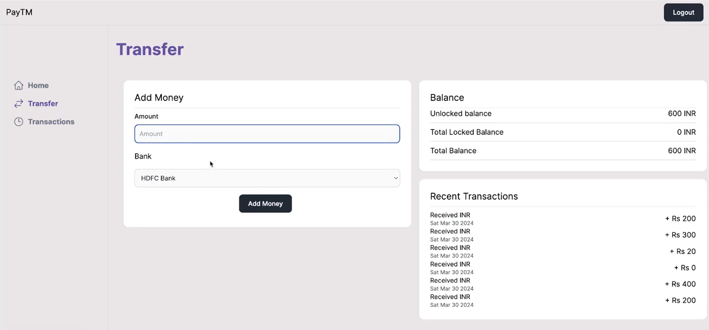
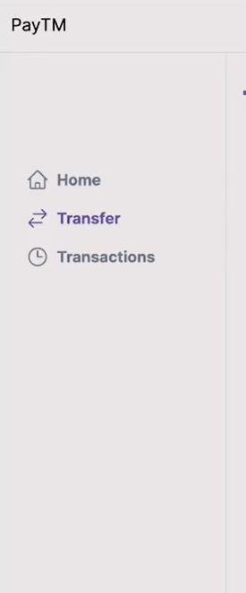
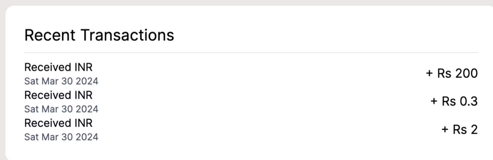

# Paytm Platform - README

## Overview

This project is a comprehensive platform that integrates various modules, including payment processing with **Paytm**, a **Bank Webhook**, and both **Merchant** and **User Applications**. The project utilizes modern technologies like **Next.js**, **Express.js**, and **TypeScript**. Each module is housed in its respective folder and has its own set of dependencies and functionality.

## Project Structure

The platform consists of the following three major components:

1. **Paytm Bank Webhook**  
   This module handles bank-related webhooks, processes transactions, and interacts with the centralized database.

2. **Merchant Application**  
   A frontend and backend solution for merchants to manage their stores, products, and transactions.

3. **User Application**  
   The user-facing side of the platform where users can browse products, make payments, and manage their accounts.

## Technologies Used

- **Frontend:** Next.js, React, Recoil, Tailwind CSS
- **Backend:** Node.js, Express.js, esbuild
- **Database:** Integrated through `@repo/db`
- **Authentication:** next-auth
- **Build Tools:** TypeScript, esbuild, ESLint

## Screenshots

Here are some screenshots of the platform:

1. 
2. 
3. 

## Project Setup and Installation

To get the project running locally, follow these steps:

1. **Clone the Repository**

   ```bash
   git clone https://github.com/your-username/your-repo.git
   ```

2. **Navigate into each folder** (`bank-webhook`, `web`, `docs`) and install the dependencies:

   ```bash
   cd folder-name
   npm install
   ```

3. **Run the project**
   
   - For **Bank Webhook**:
   
     ```bash
     npm run dev
     ```

   - For **Merchant App** and **User App**:
   
     ```bash
     npm run dev
     ```

## Folder Structure

```bash
├── bank-webhook/
│   ├── src/
│   ├── dist/
│   └── package.json
├── web/
│   ├── pages/
│   ├── components/
│   ├── public/
│   └── package.json
├── docs/
│   ├── pages/
│   ├── components/
│   ├── public/
│   └── package.json
```

## License

This project is licensed under the MIT License. See the [LICENSE](LICENSE) file for details.

---
